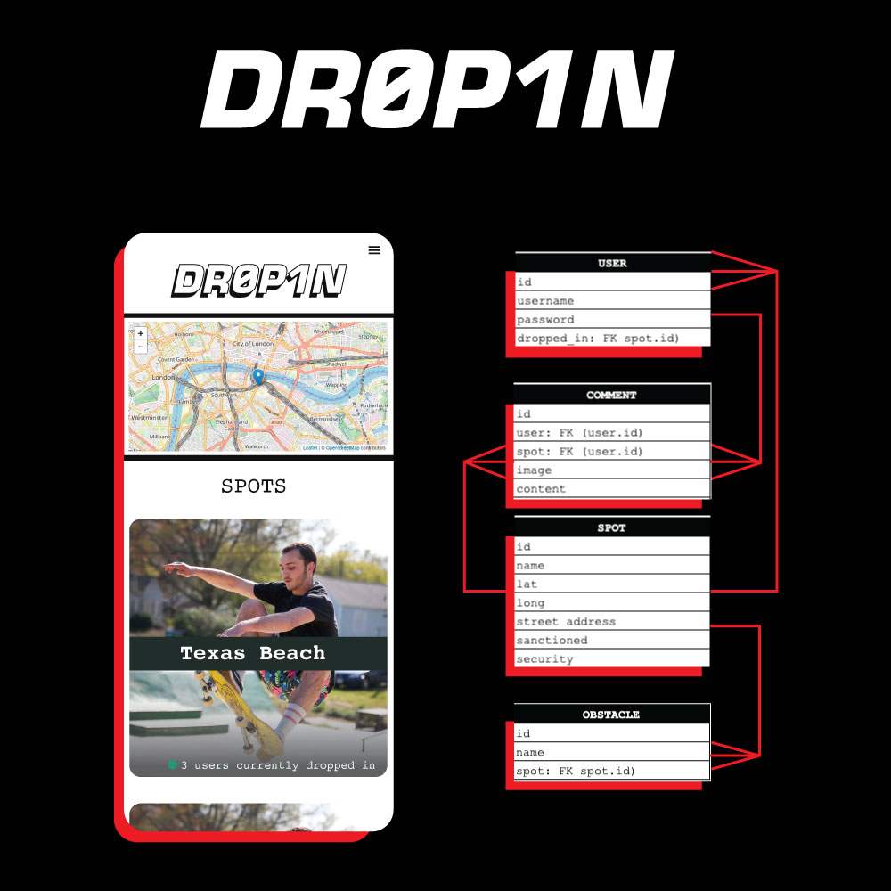
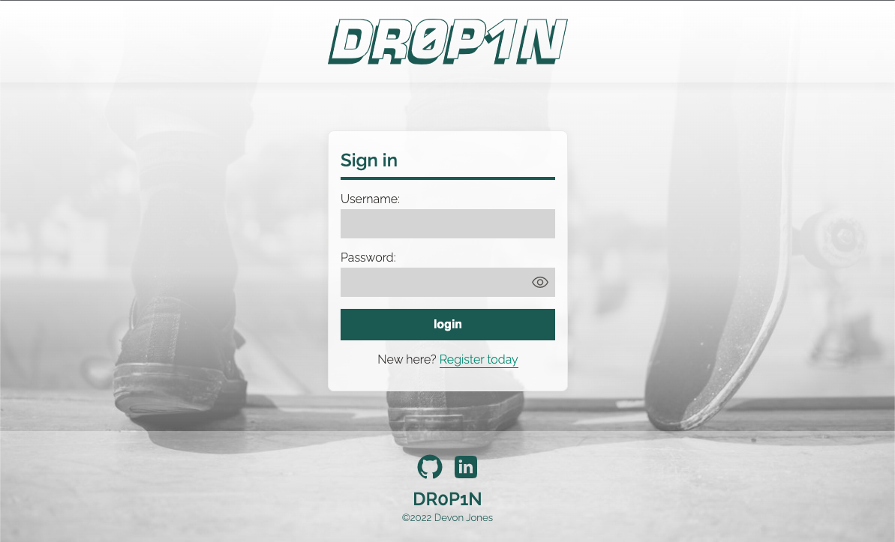
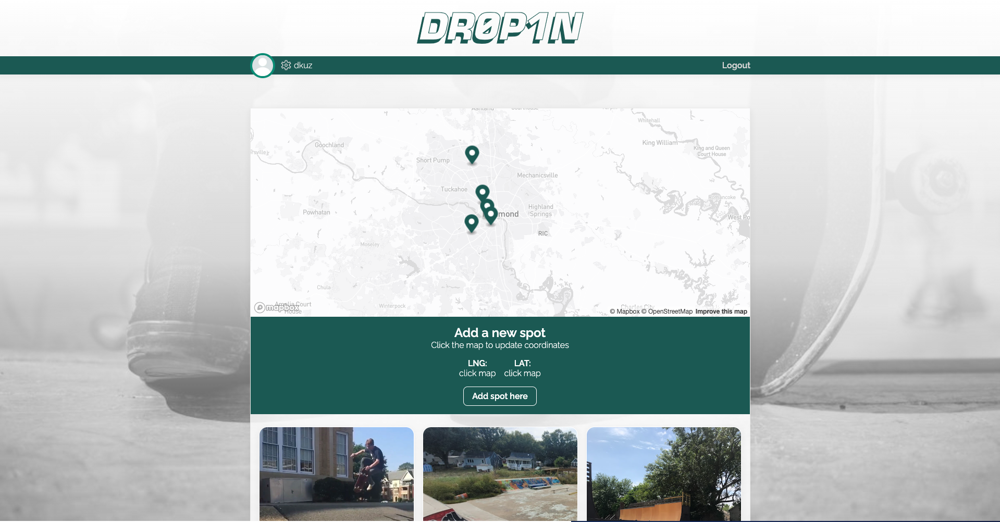
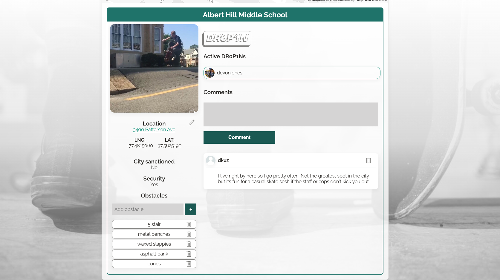
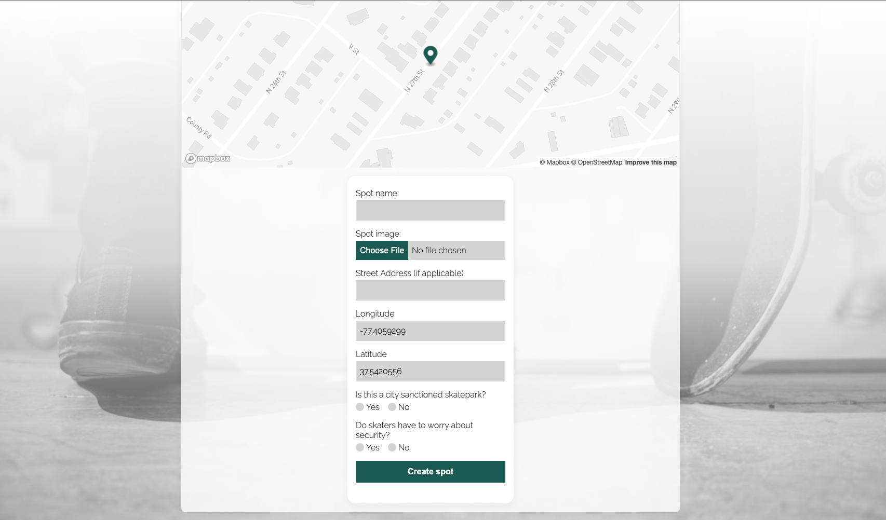

# DR0P1N


## CONCEPT

DR0P1N is a web app that enables skateboarders in the Richmond metro area to find and share skate spots with fellow skaters.

### FUNCTIONALITY

Upon registering an account, the user should be able to browse local spots, update information about these spots, create new spots, comment on spots, and DR0P1N to spots.

#### WHATS A DR0P1N?

DR0P1Ns are similar to the concept of "checking in" on the old Four Square app. The general idea is that users can arrive at a spot and DR0P1N on the app to let other users know where they're skating.

Users can check spots to see how many active DR0P1Ns there are. This has a couple benefits:

1. It lets users from out of town know where the popular skate spots are.
2. It lets local skaters link up with friends they see are active at a spot.
3. It enables users to decide whether or not they want to show up to a crowded skate spot.

## GETTING STARTED

[Checkout my trello board](https://trello.com/b/V4GlD6DK/dr0p1n)

### MVP GOALS

1. User registration and log-in for protected routes.
2. An interactive map with geo-markers representing local skatespots.
3. Mapping card elements of local spots
4. A spot detail view where users can get more information about a spot, read and post comments, update spot information, and DR0P1N.

### STRETCH

1. Adding events to spots (meetups, skate competitions, clean-ups, volunteering, etc)
2. Friends lists, leaderboards for regular DROPINs
3. User settings/panel to change username, password, upload profile picture, etc.

### PLANNING



### Execution






#### Code sample

Here's a fun bit of code I wanted to present regarding how I handled linking to Google maps. If an address exists for the spot, I split the address at spaces then rejoin them using plus signs inside a template literal containing the url.

```
{spot.address ? (
                        <p>
                          <a
                            className="inlineLink"
                            href={`http://maps.google.com/maps?q=${spot.address
                              .split(" ")
                              .join("+")}`}
                            target="_blank"
                            rel="noreferrer"
                          >
                            {spot.address.split(",")[0]}
                          </a>
                        </p>
                      ) : (
                        <p>Street address unknown</p>
                      )}
```

### TECHNOLOGY AND RESOURCES

#### FRONT END TECH
1. [React.js](https://beta.reactjs.org/) for frontend
2. [Mapbox](https://docs.mapbox.com/) for map rendering and interactivity

#### BACK END TECH
1. [Django](https://docs.djangoproject.com/en/4.1/)
2. [Django REST framework](https://www.django-rest-framework.org/)}
3. [Simple JWT](https://django-rest-framework-simplejwt.readthedocs.io/en/latest/index.html)
4. [Django CORS Headers](https://pypi.org/project/django-cors-headers/)
5. [psycopg2-binary](https://pypi.org/project/psycopg2-binary/)
6. [Pillow](https://pillow.readthedocs.io/en/stable/installation.html)

#### BACK END RESOURCES
1. [Authentication & Refreshing Tokens Implementation](https://youtu.be/xjMP0hspNLE) | Dennis Ivy | Youtube
2. [Refreshing Tokens With Axios Interceptors](https://youtu.be/16-1mTdGBoM) | Dennis Ivy | Youtube
3. [JWT.IO](https://jwt.io/) for decoding tokens/testing.

## ROADMAP & UPDATES

### UPDATES

1. (01/13/2023) Updated Django models to add new column for imageURL field. Also removed image upload on frontend for adding/updating spots and replaced with imageURL field (heroku not hosting/serving image uploads).

### TODO

1. Refactor code
2. Play up the social element of the app to include profiles, statuses, comment likes and replies, friend-lists and notifications (X friend is skating at Y spot, X person responded to Y comment, etc).
3. Add front-end CRUD for user to update profile picture, username, change password, etc.
4. Enable photo upload on comments (model supports this already but due to time constraints I didnt implement it).
5. Add form validation and error handling (little to none atm)
6. Update comment model to include timestamp (right now there's no creation date/time so comments just kind of exist)
7. Fix bug on homepage spot cards (if you click on the image background within the div it redirects fine to the spot detail but if you click on the name of the spot there are issues).

